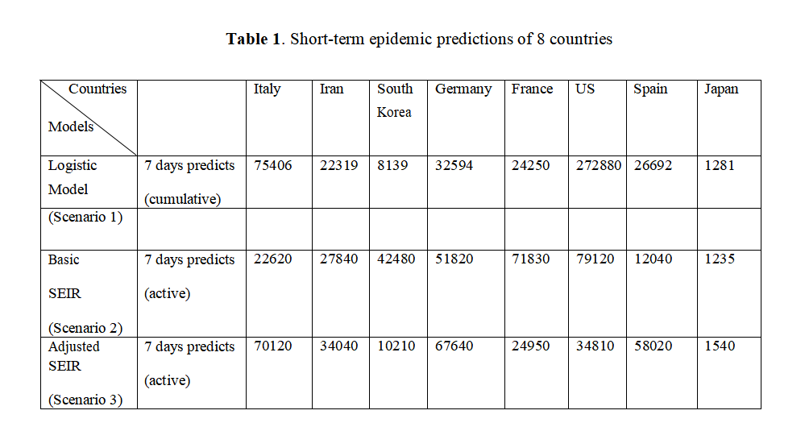
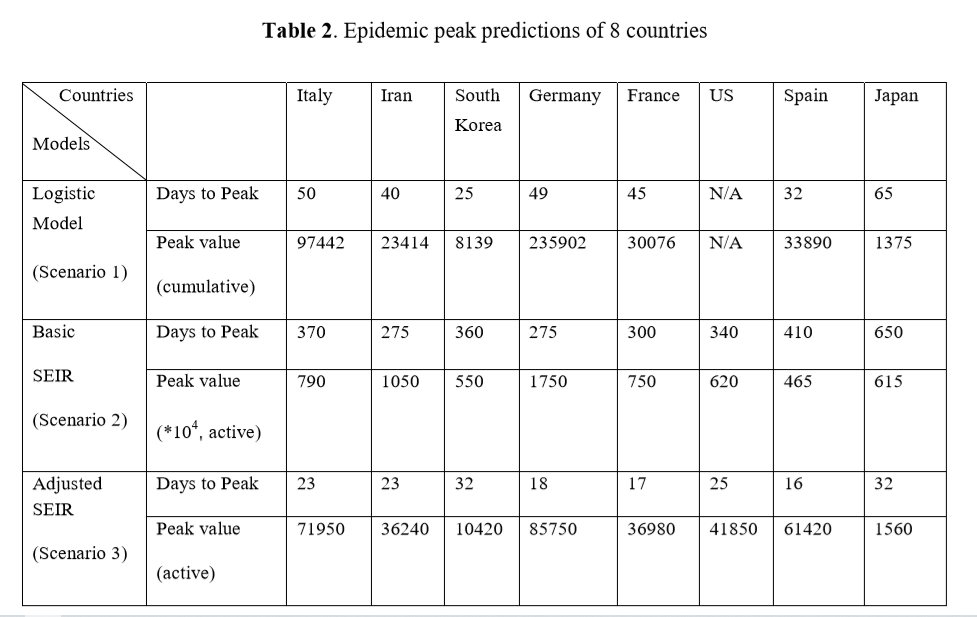

##1 介绍
新型冠状病毒是一项重大的公共卫生事件。尽管政府采取了各种措施来保护其城市或国家，例如交通限制，旅行者隔离要求，接触者追踪等，但全球人口大规模流动已经引起该疾病的迅速传播，导致全世界流行。2020年2月，世界卫生组织（WHO）将疾病命名为COVID-19，其代表2019年冠状病毒疾病。引起COVID-19的病毒被命名为严重急性呼吸系统综合症冠状病毒2（SARS-CoV-2）。 SARS-CoV-2病毒主要通过人与人的密切接触以及通过被感染者咳嗽或打喷嚏时产生的呼吸道飞沫传播。该病在中国得到控制的同时，COVID-19的全球传播已造成在亚洲，欧洲，中东和北美激增。截至2020年3月11日，随着全球风险不断增加，在114个国家中已经有超过118,000例病例，并有4,291人丧生，WHO将COVID-19列为大流行。

随着在150多个国家和地区发生的病例数量不断增加，对COVID-19的传播动态进行建模并估算其发展状况对于为公共卫生部门和医疗政策制定者提供决策支持至关重要。数学模型被广泛用于评估流行病传播，预测疾病传播趋势以及提供最佳干预策略和控制措施。最近的大量研究争相估计COVID-19的规模和严重性，一些数学模型和预测方法试图估计COVID-19的传播。大多数研究估计基本传染数R_0, R_0是评估COVID-19传播潜力的关键参数。但是，就模型结构和输入参数的差异而言，不同的模型通常会得出不同的结论。提高大流行的早期预测和预警能力是急切且必要的。

面对这种新的传染病及其具有许多未知因素的复杂特征，单一模型估计可能会推断出偏差的结果，因此，我们尝试通过比较不同模型的结果来进行整体严格的估计。为了实现客观的估计，我们研究并实施了两种最常用的方法和一种扩展方法：logistic模型SEIR模型和调整后的SEIR模型。各国对于降低COVID-19的家庭继发感染风险的干预措施的开始时间和水平不同。我们比较了考虑或不考虑这些影响的模型，预测了流行病的扩散，并试图比较3种不同模型的不同建议。
##2 方法
我们收集了分布在三大洲的八个高风险国家中COVID-19的流行情况，并将logistic模型和SEIR模型以及不同的参数设置场景的预测结果进行了比较。 数据来自约翰霍普金斯大学系统科学与工程中心（CSSE）发布的冠状病毒COVID-19全球案例。 我们使用了2020年1月23日至3月20日的现有报告数据进行观测，执行参数估计和预测不同国家/地区的COVID-19动态。
##2.1 Logistic增长模型和参数估计
在方案1中，我们假设流行趋势服从logistic增长曲线。我们使用logistic模型预测疾病趋势。logistic模型的本质是曲线拟合及其预测结果高度依赖于历史数据。在以前的研究中，它经常被用于流行病学动力学预测。在数学上，logistic模型描述受增长率和种群控制的受感染个体的动态演变容量。根据下面的常微分方程(a)，我们将获得logistic函数（b），该模型描述了报告病例数P的动态演变，该报告病例数受增长率r和P_0的控制，P_0的初始值为T=0时的确诊病例数。在该模型中确诊病例的最大值（K）,是确诊病例增加达到最终值，r是增加率。我们用最小二乘法拟合logistic增长函数，然后预测未来确诊病例的数量。由于早期报告的确诊病例数量通常不准确或缺失，因此将模型的起始日期设置为达到第100个确诊病例的日期。
dP/dt=rP(1-P/K)  (a)

P(t)=(KP_0 e^rt)/(K+P_0 (e^rt-1))    (b)
为了评估logistic模型预测COVID-19传染病的能力，自达到第100例确诊病例当天以来，我们每隔10天拟合一次逻辑曲线，每次进行7天预测并使用报告的数据进行评估。 对于实验分析，每一次预测，我们都会得到不同的结果错误差，如附录A所示。随着确诊病例数的增加，预计接下来7天的感染量以及未来的高峰规模和高峰时间都在不断变化。此外，曲线的形状可能会由于诸如新的感染爆发，控制措施的实施，公众行为等外在影响而发生变化。


##2.2 SEIR模型和参数估计

基于COVID-19感染的流行病学特征，更通常采用SEIR模型来研究这种疾病的动态。SEIR是确定性的人口传播模型，它假设人口在同一隔间中的每个个体具有相同的特征，因此将种群中的每个个体模拟为一个独立的隔间。但是，通过插入不同的参数设置，模型得出的结果不同，我们将它们的结果进行比较，以观察两种不同场景COVID-19的传播模式，即基本SEIR（场景2：无任何干预和措施）和调整后的SEIR（方案3：有严格的干预措施）。

在场景2中，我们仅使用基本SEIR模型，并将种群分为四类：易感者（$S$），潜伏者（$E$），感染者（$I$）和移除者（$R$）。SEIR模型的实质是一个关于时间的常微分方程组。它预测的疾病趋势仅取决于参数和开始时间。该模型是通过以下等式测得的，并且假设所有人都没有针对COVID-19的免疫力，因此整个人群最初都容易受到影响，最初的病例数是从报告的数据中收集的。由于在新的疫情爆发初期仍然缺乏可靠的数据，模型的起始日期被设定为每个国家出现第100例确诊病例以来的日期，这表明8个观察到的国家的起始日期不同。
$$\frac{dS}{dt}=-\frac{\beta SI}{N}$$
$$\frac{dE}{dt}=-\frac{\beta SI}{N}-\sigma E$$
$$\frac{dI}{dt}=\sigma E-\gamma I$$
$$\frac{dR}{dt}=\gamma I$$

其中$S$是易感人群的数量，$E$是潜伏者人群的数量，$I$是感染人群的数量，$R$是康复者或死亡的数量，$N$是整个人群的数量，$\beta=k*b$是受感染者接触的人群$k$和传播概率$b$的乘积。$\gamma=\frac{1}{D}$是感染者人群的平均康复率或死亡率，其中$D$是感染的平均持续时间，$\sigma$是潜伏者个体发展为感染者的转化率。
 
在场景3中，考虑到公共卫生干预因素对流行病动态的贡献，例如政府封锁城市、采取措施来跟踪和隔离与确诊病例有密切接触的人、提倡公民保持社会距离并勤洗手等，我们进一步将调整后的SEIR模型用于COVID-19估计。该模型考虑了COVID-19传播的接触率和隔离比例，并将种群分为七个类别：易感者、潜伏者、感染者、移除者、已隔离的易感者、已隔离的潜伏者和已隔离的感染者。将隔离的易感者记为$Sq$，将被分离的潜伏者记为$Eq$。详细的方程式和参数定义如下：

$$\frac{dS}{dt}=-[c\beta +cq(1-\beta)]S(I+\theta E)+\lambda S_q$$
$$\frac{dE}{dt}=c\beta (1-q)S(I+\theta E)-\sigma E$$
$$\frac{dI}{dt}=\sigma E-(\delta_I+\alpha +\gamma_I)I$$
$$\frac{dS_q}{dt}=(1-\beta)cqS(I+\theta E)-\lambda S_q$$
$$\frac{dE_q}{dt}=\beta cqS(I+\theta E)-\delta_qE_q$$
$$\frac{dH}{dt}=\delta_II+\delta_qE_q-(\alpha+\gamma_H)H$$
$$\frac{dR}{dt}=\gamma_II+\gamma_HH$$

尽管通过实施多种不同的控制措施，各国都减少了人们的社会接触，但我们以接触率和隔离比例作为模型参数进行了初步估算。此外，由于在一段时期的病例数增加之后检疫和控制措施才生效，通常已经激增到相当数量，因此，在调整后的模型中使用的8个观察国家的起始日期不同，它们被定义为各国政府宣布对大规模人口采取严格的干预措施和控制措施的日期。

我们认为，由于政府实施了严格的控制措施，接触率有所下降。根据我们先前的研究和相关研究，大规模干预开始后的接触率$c$低于8。每个国家的初始人口都是从已发布的数据中获取的，初始的感染者、康复者的人数是根据报告的数据确定的。模型参数是在拟合初始数据的基础上估算得来的，而每个国家每次接触的传播概率是根据蒙特卡洛模拟的基础上使用每个国家的早期数据估算的。根据WHO报告，我们假设中位潜伏期为5-6天（介于0-14天之间），未感染的易感人群的初始检疫比例为人口的60％〜80％（假设严格的检疫政策是大规模执行），将隔离期设为28天，死亡率是根据每个国家/地区的报告数据得出的。基于以上假设，我们应用了调整后的SEIR模型以获得最小估计。

### 2.3 传播潜力评估

&emsp;&emsp;<font
size=5>为了观测到每个国家的疫情潜在增长速度，文章中使用了两个参数进行估计。一个是logistic曲线的增长率（对于logistic曲线，增长率越大曲线增长更快）。另一个参数是基础传染系数$R_0$。文章使用了下一代矩阵推导出的基础传染数公式如下：

&emsp;&emsp;$$R_0=\frac{\beta}{\gamma}=\frac{k*b}{1/D}$$

&emsp;&emsp;$\beta$是与确诊人员$(k)$有接触后感染的人数，$b$是接触后可能感染的概率。$\gamma=1/D$是感染人数中恢复健康或者死亡平均比率。$D$是感染的平均持续时间。根据COVID-19疫情的相关研究$^{[7]})$中的假设，令D=7来获得$R_0$的估计值。


## 3. 结论
### 3.1 COVID-19疫情进展
 
&emsp;&ensp;&ensp;<font
size=5>文章中通过绘制八个海外国家的疫情曲线来辅助预测全球疫情趋势，并揭示了不同国家的疫情传播模式。

&emsp;&emsp;从下图疫情数据曲线中容易看出，意大利、韩国、伊朗、法国等国家的确诊人数增长速度很快。

数据来源为[约翰霍普金斯环球疫情](https://coronavirus.jhu.edu/map.html)
```{r，echo=F}
Data <- read.table("confirmed number.csv",sep = ",",header=T)
library(zoo)
library(xts)
options(warn=-1)
faguo <- xts(Data$France, as.Date(Data$time, format='%Y/%m/%d'))
deguo <- xts(Data$Germany, as.Date(Data$time, format='%Y/%m/%d'))
yilang <- xts(Data$Iran, as.Date(Data$time, format='%Y/%m/%d'))
yidali <- xts(Data$Italy, as.Date(Data$time, format='%Y/%m/%d'))
xibanya <- xts(Data$Spance, as.Date(Data$time, format='%Y/%m/%d'))
ruidian <- xts(Data$Switzerland, as.Date(Data$time, format='%Y/%m/%d'))
yingguo <- xts(Data$UK, as.Date(Data$time, format='%Y/%m/%d'))
meiguo <- xts(Data$US, as.Date(Data$time, format='%Y/%m/%d'))
plot(faguo,type='l',main ='',col="blue")
lines(deguo,type='l',main='',col="red")
lines(yilang,type='l',main='',col="green")
lines(yidali,type='l',main ='',col="grey")
lines(xibanya,type='l',main='',col="yellow")
lines(ruidian,type='l',main='',col="black")
lines(yingguo,type='l',main='',col="brown")
lines(meiguo,type='l',main='',col="purple")

```

&emsp;&emsp;<font
size=5>文章将各个国家疫情曲线的绘制起始时间设置为八个国家中确诊人数达到一百例的日期。(如韩国是2020年2月20号)

&emsp;&emsp;<font
size=5>一般来说，疫情曲线遵先上升--到达顶峰--下降的规律。然而，在文章的观测期间（上图中也可以看出），八个国家仍然处在它们的疫情人数上升阶段，尚未到达疫情顶峰或下降阶段。

***
### 八个国家的疫情现状（截止4月12日）

国家 |治愈人数|死亡人数|治愈率|死亡率
---|----|----|---|---
法国|27186|14393|20.5%|10.9%
德国|60300|3022|47.2%|2.36%
伊朗|43894|4474|61.2%|6.24%
意大利|34211|19899|21.9%|12.7%
日本|762|108|11.3%|1.60%
韩国|7368|214|70.1%|2.04%
西班牙|62391|17209|37.4%|10.32%
美国|32988|22020|5.9%|3.97%

## 3.2 模型预测

&emsp;&emsp;<font
size=5>从三个预测模型的比较结果中，关于COVID-19疫情的发展文章中有不同的结果，如表1（截止到2020.3.20）和表2所示。由于不同的模型建立在不同的理论和假设上，其输出测量值也不同，其中累计数为logistic模型，active数为SEIR模型。从结果中可以看出三种数理模型的差异，并进一步展示了在不考虑干预的情况下的预测差异。

<center></center>

&emsp;&emsp;<font
size=5>在情景1中，基于logistic模型，文章预测了八个国家的疫情发展趋势，表1和附录B详细地列出了八个国家的预测结果和增长轨迹。例如，该模型将意大利的感染高峰时间设定在2020年2月23日开始后的50天，最多感染人数为97442人。而美国目前报道的数据是无法依据logistic模型来预测的，因为它是指数增长的，是无法适配于logistic曲线的，这也表明了美国正处于疫情迅速传播的阶段。

***

&emsp;&emsp;<font
size=5>在情景2中，基础SEIR模型结果表示，如果没有任何控制和干预措施的话，确诊病例会在9-22个月（275-650天）后到达顶峰，在经历如此长时间的传播后大多数人最终都会被感染。此外，高峰时期的活跃病例将达到这些国家的10-20%左右，最糟糕的情况就是国家的医疗系统不堪重负，如表2所示。

<center></center>

&emsp;&emsp;在情景3，调整后的SEIR模型结果表示，在严格的控制措施下，八个国家的确诊人数会在达到100例的那天起后的16-32天（从2020年的4月上旬到4月中旬）内达到顶峰。在疫情刚刚开始发生传播的时候，日本和韩国就采取了相应的隔离措施，因此预测它们的确诊人数峰值会很小，而且与别的国家相比累计确诊病例也比较少。这也充分说明了在疫情蔓延早期时候进行控制是特别有效的。除此之外，从现有数据来看，欧洲国家和美国仍处于疫情爆发阶段，情势不容乐观。

&emsp;&emsp;文章利用相应的研究方法向我们展示了确诊人数的动态变化。场景3的估计是基于严格隔离的假设下。结果表明，实行控制措施会显著降低疫情高峰，并加速疫情高峰的到来。结果还表明接触率是影响控制措施效果的重要因素。通过制定和实施严格的防疫措施来降低接触率，从而减轻疫情患病人数规模和降低疫情峰值。然而，疫情在峰值过后仍然存在很长的拖尾性，这就需要延长易感者的隔离时间来减少。

###3.3传播势
Logistic曲线的增长率也列为传播潜力指数，用于比较表3中的8个国家。我们的结果表明，除了日本（日本的传播速度有所放缓）以外，这些国家在病毒快速传播方面都具有高风险。根据先前传播动力学研究的证据，已记录的COVID-19 R0范围为2.0至4.914-17。 我们估计的R0范围在1.687〜3.864之间（根据报告的COVID-19研究，假设平均感染期为7天）。
##4讨论
根据COVID-19数据跟踪，它表明这8个国家推迟了预防流行的阶段，并进入了真正的社区传播病例的爆发阶段。 死亡率分析表明，某些国家可能发生了未发现的传播事件。 八个国家中有七个国家的R0等级高于3，这值得我们注意。
据报道，死亡率高是由于未发现的传播事件的主要原因，可能是某些病例无症状或缺乏检测试剂盒。因为我们的方案2和方案3分别基于最大假设（没有任何干预）和最小假设（有严格干预）。在方案3中，在假设感染者得到及时检测和计数的假设下，调整后的模型表明，严格执行两轮14天的大规模隔离后，高峰时间即将到来。如表1所示，日本和韩国的疫情规模减少。但是，考虑到每个国家的文化和医疗状况不同，政策和控制措施的实施水平也不同，因此，这些国家的实际情况应介于方案2和方案3之间。值得指出的是，与不采取干预措施相比，如果政府采取严格的控制措施以减少人口流动，迅速进行诊断和隔离，高峰时间将达到，高峰规模将在30天左右大大降低到一个相对较低的水平，这最好在流行病的早期触发。但是，需要将其维持几个月直到疫苗可用。 相反，只要疫情没有结束，如果政府放宽干预措施，使人们回到近距离的社会距离，仍有可能爆发疾病。
扩散势的结果表明，COVID-19的R0值与R0值在2.0到5.018之间的SARS病毒相似，比 R0值在1.2到3.719之间的流感病毒H1N1和R0值在1.34到3.6520之间的埃博拉病毒高。 COVID-19是一种高度传染性的人传人疾病。与政府实施控制措施后的初期相比，R0预计会大大降低，但是，无论每个国家执行哪种政策，每种政策在防御COVID-19方面都有其局限性，传播会一直持续到有了疫苗或病毒随季节或人群免疫消失而消失。 因此，监测所有传播事件是当前阶段控制COVID-19的最关键问题，因为在本地任何未发现的病例都可以开始新的传染病传播链，此外，公众还应采取适当的防护措施抵抗COVID-19的传播。
从数学模型的角度来看，SEIR模型是为传染病估计而设计的，然而，logistic增长模型是为适应曲线发展而设计的。与SEIR模型相比，logisti模型可能更适合现有数据，因为它是经过现有数据训练的，但是无法准确地判断并包含传染性特征。因此，我们认为，logistic增长模型短期预测更好。 另一方面，SEIR模型通过考虑多个人群的相互作用和联系引入了更多的变量和因素，它比logistic模型更合理，因为它遵循传染病发展的规则，但是当考虑不同的干预措施和设置时，预测结果会有很大差异。
该研究有一些局限性。数学模型是快速合并多个输入以产生预测结果。 但是，此过程涉及对不确定因素进行假设，例如，很难准确确定人们是否遵循当地政府的检疫政策或措施诸如洗手，戴口罩，远离社会等公共行为。这可能会影响实际的接触率和随后的传染病发展。这些模型还缺乏足够的数据来估计特定人群的隔离比例。 实际上，传染病的演变相当复杂，我们的研究仅考虑了一些因素。此外，缺少测试工具包意味着许多方式在某些国家/地区尚未经过测试，并且如果没有可靠的测试，则官方的疫情数据还不完整。 当使用不完整的数据时，一个因素中的一个小误差可能会产生超大影响。
总之，我们的研究表明，降低接触率是控制早期疾病传播的关键措施，而实施足够的隔离期将减少高峰期的病例规模。因此，在COVID-19的早期传播阶段实施强有力的遏制政策并降低高峰以避免医疗体系超负荷，应被列为这些高风险国家/地区的主要行动措施。在严格的隔离期过后，政府仍然需要提高公众的预防意识，采取自我保护的行为，使这一传染病事件控制到只有零星的几个。
