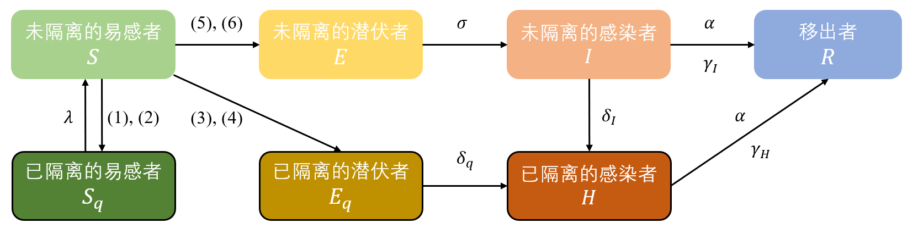
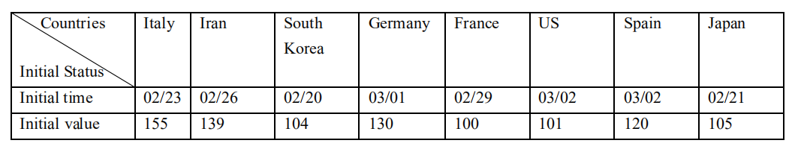
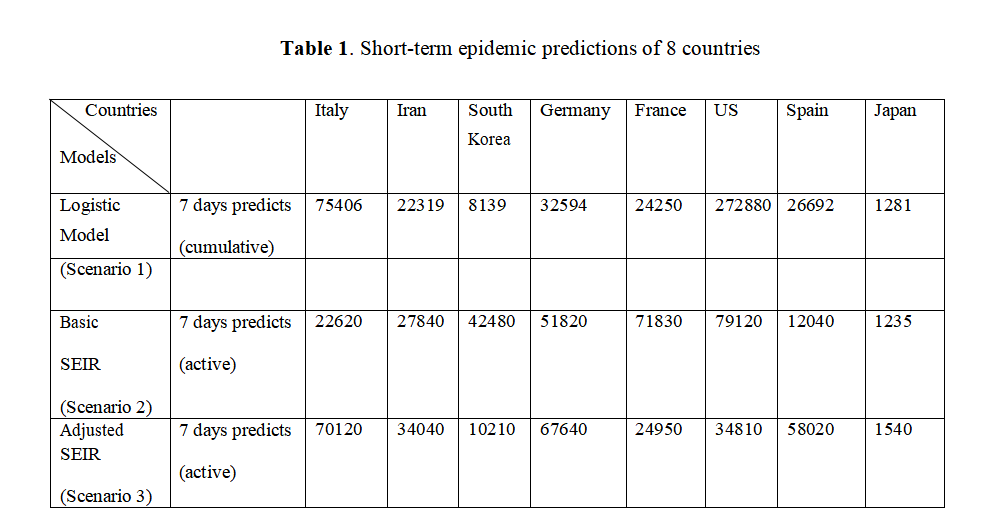
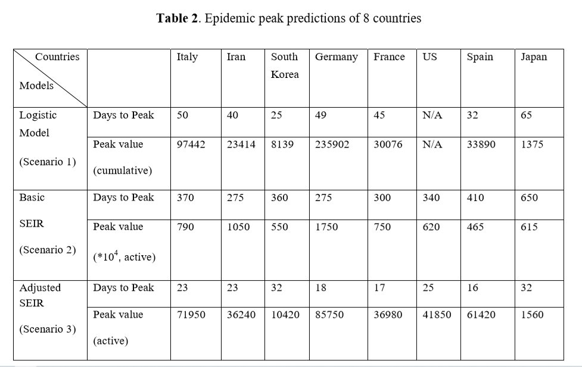
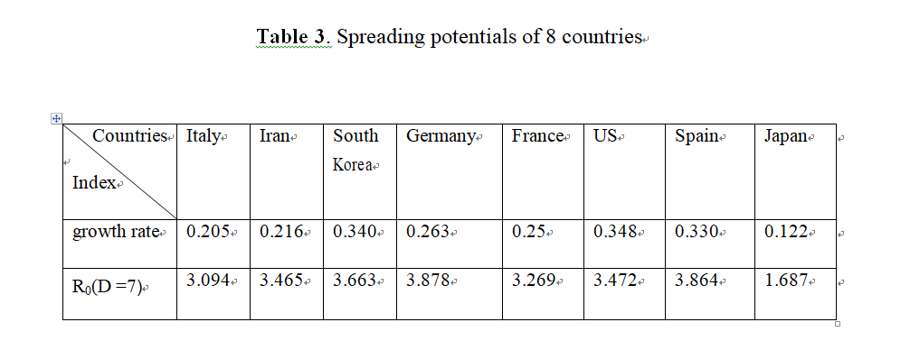

class: center, middle

### Forecasting the Worldwide Spread of COVID-19 based on Logistic Model and SEIR Model

Xiang Zhou, Na Hong, Yingying Ma, Jie He, Huizhen Jiang, Chun Liu, Guangliang Shan, Longxiang Su, Weiguo Zhu, Yun Long

(https://www.medrxiv.org/content/10.1101/2020.03.26.20044289v2)

---

## 演示内容

### 1 研究背景

### 2 研究方法

- 2.1 Logistic增长模型

- 2.2 基本SEIR模型

- 2.3 改进的SEIR模型

- 2.4 传播潜力评估

### 3 数据来源及说明

---

### 4 结论

- 4.1 COVID-19疫情进展

- 4.2 八个国家的疫情现状（截至4月12日）

- 4.3 模型预测

- 4.4 传播潜力

### 5 讨论

---

## 1 研究背景

&emsp;&emsp;COVID-19是一项重大的公共卫生事件。尽管各国政府采取了各种措施来保护城市或国家，例如交通限制、旅行者隔离要求、接触者追踪等，但大规模的全球人口流动已经引起该疾病的迅速传播，使其在全世界蔓延。疫情在中国得到控制的同时，COVID-19的全球传播已造成在亚洲、欧洲、中东和北美激增。

--

&emsp;&emsp;2020年2月下旬全球突然增加的病例引起了人们的深切关注。意大利、韩国、伊朗、法国、德国、西班牙、美国和日本可能是最严重的国家。收集流行病学数据和预测流行趋势对于制定和衡量公共干预策略具有重要意义。面对这一新传染病及其具有许多未知因素的复杂特征，单一的模型估计可能会得出有偏的结果，不同数学模型产生的流行病预测结果是不一致的，因此，作者试图比较不同模型及其预测结果，从而得出客观的结论。

---

## 2 研究方法

&emsp;&emsp;利用2020年1月23日至3月20日报告的病例数来估计COVID-19可能的疫情规模和峰值时间，特别是在8个高风险国家。采用Logistic增长模型、基本SEIR模型和改进的SEIR模型进行预测。考虑到不同的模型输入可以推断不同的模型输出，在三种疫情发展场景下实现了三种模型预测。

---

### 2.1 Logistic增长模型

&emsp;&emsp;Logistic模型的本质是曲线拟合，其预测结果高度依赖于历史数据。在以往的研究中，它常被用于流行病的动态预测。

--

- $P$：确诊病例数
- $r$：确诊病例的增长率
- $P_0$：初始时刻（T=0）的确诊数
- $P_m$：最大病例数

--

&emsp;&emsp;根据的常微分方程(1)，将得到Logistic函数(2)：
$$\frac{dP}{dt}=rP(1-\frac{P}{P_m})\tag{1}$$
$$P(t)=\frac{P_0P_me^{rt}}{P_m+P_0 (e^{rt}-1)}\tag{2}$$
--

&emsp;&emsp;采用OLS拟合Logistic增长函数，用以预测未来确诊病例的数量。

---

### 2.2 基本SEIR模型（无任何干预和措施）

&emsp;&emsp;SEIR模型是带潜伏期的恶性传染病模型。SEIR模型假设总人口不变，将人群分类，每种类型作为一个“仓室”存在，假设在同一“仓室”中的每个个体具有相同的特征。

--

- $\beta$： $\beta=k*b$ 是与感染者进行接触的人数 $k$ 和接触后感染概率 $b$ 的乘积
- $\sigma$：潜伏者转化为感染者的概率
- $\gamma$： $\gamma=1/D$ 是感染人群中恢复健康或者死亡的平均比率，其中 $D$是感染的平均持续时间

```{r fig.align='center', echo=FALSE}

```

--

&emsp;&emsp;SEIR模型的实质是一个关于时间的常微分方程组。它预测的疾病趋势仅取决于参数和开始时间。

$$\begin{cases}
\frac{dS}{dt}=-\frac{\beta SI}{N}\\
\frac{dE}{dt}=\frac{\beta SI}{N}-\sigma E\\
\frac{dI}{dt}=\sigma E-\gamma I\\
\frac{dR}{dt}=\gamma I\\
\end{cases}$$

---

### 2.3 改进的SEIR模型（有严格的干预措施）

&emsp;&emsp;考虑到公共卫生干预因素对传染病动态的影响，例如政府封锁城市、采取措施来跟踪和隔离与确诊病例有密切接触的人等，进一步改进SEIR模型。

--

&emsp;&emsp;该模型考虑了COVID-19传播的接触率和隔离比例，并将人群分为七个类别：易感者、潜伏者、感染者、移出者、已隔离的易感者、已隔离的潜伏者和已隔离的感染者。详细的参数定义如下：


|参数|定义|参数|定义|
|:-:|:-|:-:|:-|
| $c$ |接触率| $\delta_I$ |感染者的隔离速率|
| $\beta$ |传染概率| $\delta_q$ |已隔离的潜伏者向已隔离的感染者转化的速率|
| $q$ |隔离比例| $\gamma_I$ |感染者的康复率|
| $\sigma$ |潜伏者向感染者转化的速率| $\gamma_H$ |已隔离的感染者的康复率|
| $\lambda$ |隔离解除速率| $\alpha$ |病死率|
| $\theta$ |潜伏者相对于感染者传播能力的比值|

---

```{r fig.align='center', echo=FALSE}

```

--

- $S$ 向 $S_q$ 转化的速率为 $c(1-\beta)q$ ，同时考虑到 $I$ 和 $E$ 对易感人群的影响

&emsp;&emsp;(1) $c(1-\beta)qSI$

&emsp;&emsp;(2) $c(1-\beta)qS\theta E$

--

- $S$ 向 $E_q$ 转化的速率为 $c\beta q$ ，同时考虑到 $I$ 和 $E$ 对易感人群的影响

&emsp;&emsp;(3) $c\beta qSI$

&emsp;&emsp;(4) $c\beta qS\theta E$

--

- $S$ 向 $E$ 转化的速率为 $c\beta (1-q)$ ，同时考虑到 $I$ 和 $E$ 对易感人群的影响

&emsp;&emsp;(5) $c\beta (1-q)SI$

&emsp;&emsp;(6) $c\beta (1-q)S\theta E$

---

$$\frac{dS}{dt}=-[c\beta +cq(1-\beta)]S(I+\theta E)+\lambda S_q$$

$$\frac{dE}{dt}=c\beta (1-q)S(I+\theta E)-\sigma E$$

$$\frac{dI}{dt}=\sigma E-(\delta_I+\alpha +\gamma_I)I$$

$$\frac{dS_q}{dt}=(1-\beta)cqS(I+\theta E)-\lambda S_q$$

$$\frac{dE_q}{dt}=\beta cqS(I+\theta E)-\delta_qE_q$$

$$\frac{dH}{dt}=\delta_II+\delta_qE_q-(\alpha+\gamma_H)H$$

$$\frac{dR}{dt}=(\gamma_I+\alpha)I+(\gamma_H+\alpha)H$$

---

### 2.4 传播潜力评估

&emsp;&emsp;使用两个参数对疫情的传播潜力进行估计。一个是Logistic曲线的增长率（该增长率越大，曲线增长就越快），另一个是基本传染数 $R_0$ ，推导出的基本传染数公式如下：

$$R_0=\frac{\beta}{\gamma}=\frac{k*b}{1/D}$$

其中 $\beta$ 是 $k$ 和 $b$ 的乘积， $k$ 是与确诊人员进行接触的人数， $b$ 是接触后可能感染的概率。 $\gamma=1/D$ 是感染人群中恢复健康或者死亡的平均比率， $D$ 是感染的平均持续时间。

---

## 3 数据来源及说明

&emsp;&emsp;8个高风险国家（意大利、韩国、伊朗、法国、德国、西班牙、美国和日本）的COVID-19疫情数据来自约翰霍普金斯大学系统科学与工程中心（CSSE）运营的COVID-19全球数据库（https://github.com/CSSEGISandData/COVID-19 or https://coronavirus.jhu.edu/map.html）。

&emsp;&emsp;每个国家的初始人口数据源于联合国统计司公布的数据。

--

&emsp;&emsp;由于早期报告的确诊病例数量通常不准确或缺失，因此将模型的起始日期设置为达到第100个确诊病例的日期，这表明8个受观察国家的起始日期不同。

```{r fig.align='center', echo=FALSE}

```

---

&emsp;&emsp;为了评估Logistic模型预测COVID-19疫情的能力，自达到第100例确诊病例当天开始，每隔10天拟合一次Logistic曲线，每次进行7天预测并使用数据进行评估。

--

&emsp;&emsp;改进的SEIR模型中，由于政府实施了严格的控制措施，接触率有所下降。根据相关研究，大规模干预开始后的接触率 $c$ 低于8。使用MCMC方法和MH算法采样，将正态分布作为建议分布，估计改进的SEIR模型的参数，将疫情数据应用于上述统计推断，并模拟传染病传播的过程。根据WHO报告，假设中位潜伏期为5-6天（介于0-14天之间），未感染的易感人群的初始隔离比例为人口的60％〜80％（假设大规模执行严格的隔离政策），将隔离期设为28天。死亡率是根据每个国家或地区的报告数据得出的。

---

## 4 结论

### 4.1 COVID-19疫情进展
 
&emsp;&emsp;通过绘制八个海外国家的疫情曲线来辅助预测全球疫情趋势，并揭示了不同国家的疫情传播模式。从下图疫情数据曲线中容易看出，意大利、韩国、伊朗、法国等国家的确诊人数增长速度较快。

```{r，echo=FALSE}
library(ggplot2)
library(reshape2)
library(forcats)
data<-read.csv('confirmed number.csv')
data<-melt(data,id.vars = 'day',
            variable.name = "country",value.name = "num") 
num <- c(runif(53),runif(53,min=100,max=560000))
data$day<-fct_inorder(data$day)
ggplot(data = data, mapping = aes(x = day, y = num, colour = country,group = country )) +
       geom_line(size = 0.5) +
       geom_point(size = 1.5) +
       labs(title = "八个国家确诊人数:",subtitle = "单位：人",x = '时间',y = '人数') +
       theme(axis.text.x = element_text(angle = 60, hjust = 0.5, vjust =0.5 ,size = 8))

```

---

```{r，echo=FALSE}
library(ggplot2)
library(reshape2)
library(forcats)
data<-read.csv('confirmed number(no US).csv')
data<-melt(data,id.vars = 'day',
            variable.name = "country",value.name = "num") 
num <- c(runif(53),runif(53,min=100,max=560000))
data$day<-fct_inorder(data$day)
ggplot(data = data, mapping = aes(x = day, y = num, colour = country,group = country )) +
       geom_line(size = 0.5) +
       geom_point(size = 1.5) +
       labs(title = "八个国家确诊人数:",subtitle = "单位：人",x = '时间',y = '人数') +
       theme(axis.text.x = element_text(angle = 60, hjust = 0.5, vjust =0.5 ,size = 8))

```
&emsp;&emsp;将各个国家疫情曲线的绘制起始时间设置为八个国家中确诊人数达到一百例的日期。(如韩国是2020年2月20号)

&emsp;&emsp;一般来说，疫情曲线遵先上升--到达顶峰--下降的规律。然而，在文章的观测期间（上图中也可以看出），八个国家仍然处在它们的疫情人数上升阶段，尚未到达疫情顶峰或下降阶段。

---

### 4.2 八个国家的疫情现状（截至4月12日）

国家 |治愈人数|死亡人数|治愈率|死亡率
---|----|----|---|---
法国|27186|14393|20.5%|10.9%
德国|60300|3022|47.2%|2.36%
伊朗|43894|4474|61.2%|6.24%
意大利|34211|19899|21.9%|12.7%
日本|762|108|11.3%|1.60%
韩国|7368|214|70.1%|2.04%
西班牙|62391|17209|37.4%|10.32%
美国|32988|22020|5.9%|3.97%

---

### 4.3 模型预测

&emsp;&emsp;从3个预测模型的比较结果中，关于COVID-19疫情的发展文章中有不同的结果。由于不同的模型建立在不同的理论和假设上，其输出测量值也不同，其中累计数为Logistic模型，active数为SEIR模型。从结果中可以看出三种数理模型的差异，并进一步展示了在不考虑干预的情况下的模型预测差异。

---

```{r fig.align='center', echo=FALSE}

```

&emsp;&emsp;基于logistic模型，文章预测了8个国家的疫情发展趋势，详细地列出了各国的预测结果和增长轨迹。例如，该模型将意大利的感染高峰时间设定在2020年2月23日开始后的50天，最多感染人数为97442人。基于Logistic模型根据目前报道的数据是无法预测美国的感染人数，因为其呈现为指数增长，难以拟合Logistic曲线，这也表明了美国正处于疫情迅速传播的阶段。

---

&emsp;&emsp;基础SEIR模型结果表明，如果没有任何控制和干预措施的话，确诊病例会在9-22个月（275-650天）后到达顶峰，大多数人最终都会被感染。此外，高峰时期的活跃病例将达到这些国家人口的10-20%左右，最糟糕的情况就是国家的医疗系统不堪重负，如表2所示。

```{r fig.align='center', echo=FALSE}

```

---

&emsp;&emsp;改进的SEIR模型结果表明，在严格的控制措施下，8个国家的确诊人数将在起始日（达到第100例确诊病例）后的16-32天（从2020年的4月上旬到4月中旬）内达到顶峰。在疫情初期，日本和韩国就采取了相应的隔离措施，因此预测它们的确诊人数峰值会很小，而且与别的国家相比累计确诊病例也比较少。这也充分说明了在疫情蔓延早期时候进行控制是特别有效的。除此之外，从现有数据来看，欧洲国家和美国仍处于疫情爆发阶段，情势不容乐观。

--

&emsp;&emsp;文章利用相应的研究方法向我们展示了确诊人数的动态变化。结果表明，实行控制措施会显著降低疫情高峰，并加速疫情高峰的到来。结果还表明接触率是影响控制措施效果的重要因素。通过制定和实施严格的防疫措施来降低接触率，从而减轻疫情患病人数规模和降低疫情峰值。然而，疫情在峰值过后仍然存在很长的拖尾性，这就需要延长易感者的隔离时间来减少。

---

### 4.4 传播潜力

&emsp;&emsp;Logistic曲线的增长率也被列为传播潜力指数，用于比较表3中的8个国家。我们的结果表明，除了日本的传播速度有所放缓以外，这些国家在疫情快速传播方面都具有很高的风险。根据传染病动力学研究，已记录的COVID-19的基本传染数 $R_0$ 范围为2.0至4.9。根据WHO的COVID-19研究报告，假设平均感染期为7天，估计的 $R_0$ 范围在1.687〜3.864之间。

```{r fig.align='center', echo=FALSE}

```

---

## 5 讨论

&emsp;&emsp;从数理模型的角度来看，SEIR模型是用来估计传染病的，而Logistic增长模型是用来拟合曲线发展的。与SEIR模型相比，Logistic模型可以更好地拟合已有数据，因为它是经过现有数据训练的，但是无法准确地判断和融合传染特征。因此认为Logistic增长模型的短期预测更好。另一方面，SEIR模型通过考虑多人群的相互作用和关联，引入了更多的变量和因素，比Logistic模型更符合传染病发展规律，但是在考虑不同的干预措施时，预测结果会有很大差异。

--

&emsp;&emsp;这篇文章有一些局限性。数理模型通过快速合并多个输入以产生预测结果。但是，这一过程涉及到对不确定因素的假设，例如，很难准确地确定人们遵守当地政府的检疫政策或措施的程度，以及可能影响实际接触率和随后的接触率的公共行为，如洗手、带口罩、社交距离等。这些模型也缺乏足够的数据来估计特定人群的隔离比例。实际上，传染病的演变是相当复杂的，大多数研究只考虑了几个因素。此外，缺少检测试剂盒意味着在一些国家许多病例没有进行检测，如果没有强有力的检测，官方的疫情数据是不完整的。当使用不完整的数据时，一个因素中的一个小误差可能会产生巨大的影响。

---

&emsp;&emsp;总之，研究表明，降低接触率是控制早期疾病传播的关键措施，实施足够的隔离期将减少峰值的病例规模。因此，在COVID-19的早期扩散阶段实施强有力的遏制政策并降低峰值以避免医疗体系超负荷，应被列为高风险国家或地区的主要行动。在严格的隔离期过后，政府仍然需要提高公众的预防意识，采取自我保护的行为，使这一传染病事件控制到只有零星的几个。

---

class: inverse, center, middle

# 谢谢！
